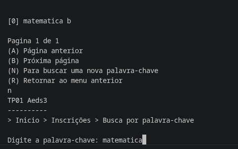
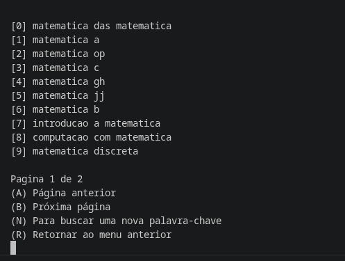

# TRABALHO PRÁTICO 03 - ALGORITMOS E ESTRUTURAS DE DADOS 3

**Pontifícia Universidade Católica**
**Ciência da Computação**

Video de demonstração do projeto:

**Autores:**
Ane M. Viana  
Camila C. Menezes  
Daniel G. Pereira  
Pedro Ítalo B. Cardoso  

---

## Sumário

1. Descrição Completa
- Visão Geral
- Implementação do Índice Invertido
- Busca por Palavras-Chave
- Classes Criadas
- Operações Implementadas
- Telas do Sistema (Prints)
2. Pergunta 01
3. Pergunta 02
4. Pergunta 03
5. Pergunta 04
6. Pergunta 05

---

## 1. Descrição Completa

### Visão Geral

O sistema desenvolvido consiste em uma plataforma de gerenciamento de cursos, permitindo que usuários criem, consultem, alterem e removam cursos. Além disso, os usuários podem realizar inscrições em cursos disponíveis, consultar detalhes dos cursos cadastrados e localizar cursos por meio de código compartilhável ou palavras-chave.

Cada curso possui um identificador único, um nome, uma descrição, uma data de início, um estado (aberto, encerrado, concluído ou cancelado) e um código compartilhável gerado automaticamente. Esse código permite localizar rapidamente um curso específico sem a necessidade de conhecer seu identificador interno.

Os dados são armazenados em arquivos persistentes e indexados por estruturas auxiliares para melhorar o desempenho das operações de busca e recuperação de informações.e evitar buscas sequenciais.

### Implementação do Índice Invertido

Como requisito desta etapa do trabalho, foi implementado um índice invertido para os nomes dos cursos utilizando a classe ListaInvertida disponibilizada pelo professor.

O índice é atualizado automaticamente sempre que um curso é criado ou tem seu nome alterado. Durante esse processo, o nome do curso passa por um pré-processamento textual composto pelas seguintes etapas:

- Conversão de todas as letras para minúsculas;
- Remoção de acentos;
- Separação do texto em palavras individuais;
- Remoção de stop words (palavras irrelevantes para a busca, como artigos e preposições);
- Cálculo da frequência relativa de cada termo (TF).

Após o processamento, os termos são armazenados na estrutura de índice invertido juntamente com seus respectivos valores de frequência.

### Busca por Palavras-Chave

Foi implementada uma busca textual baseada no modelo TF×IDF.

Quando o usuário informa uma palavra-chave:

1. O texto digitado passa pelo mesmo processo de normalização utilizado na indexação;
2. Os termos são pesquisados no índice invertido;
3. Os pesos dos documentos são calculados utilizando TF×IDF;
4. Os resultados são ordenados por relevância;
5. Os cursos mais relevantes são exibidos primeiro.

Os resultados da busca são apresentados de forma paginada, exibindo até 10 cursos por página, permitindo navegação entre páginas quando necessário.

### Classes Criadas

ArquivoTF:  
Classe criada para realizar a manutenção do índice invertido dos nomes dos cursos.

Responsabilidades:

- Inserir novos termos no índice durante a criação de cursos;
- Atualizar os termos quando o nome do curso é alterado;
Remover referências antigas do índice.

TF:  
Classe responsável pelo processamento textual e cálculo da frequência dos termos.

Principais operações:

- Remoção de acentos;
- Conversão para letras minúsculas;
- Remoção de stop words;
- Cálculo do valor TF (Term Frequency).

IDF:  
Classe responsável pela recuperação dos termos armazenados no índice invertido e pelo cálculo do peso TF×IDF utilizado para ordenar os resultados das buscas.

Também realiza a ordenação dos cursos encontrados por relevância.

### Operações Implementadas

Busca por Código Compartilhável:  
Cada curso recebe automaticamente um código único composto por caracteres alfanuméricos. Esse código pode ser utilizado para localizar diretamente um curso específico.

Índice Invertido:  
Foi implementado um índice invertido utilizando a classe ListaInvertida para armazenar os termos presentes nos nomes dos cursos e seus respectivos valores de frequência.

Busca por Palavras-Chave Utilizando TF×IDF:  
Foi implementado um mecanismo de busca textual baseado no cálculo TF×IDF. Os cursos retornados são ordenados automaticamente de acordo com sua relevância para a consulta realizada pelo usuário.

Atualização Automática do Índice:  
Sempre que um curso é criado ou alterado, o índice invertido é atualizado automaticamente, garantindo consistência entre os dados armazenados e os resultados das pesquisas.

### Telas do Sistema (Prints)

### Busca de Cursos

---

## 2. Pergunta 01

**O índice invertido com os termos dos nomes dos cursos foi criado usando a classe ListaInvertida?**

SIM. Foi implementado um índice invertido para os nomes dos cursos utilizando a classe ListaInvertida. A manutenção desse índice é realizada pela classe ArquivoTF, que insere os termos durante a criação dos cursos e atualiza o índice sempre que o nome de um curso é alterado. Os termos são previamente normalizados por meio da remoção de acentos, conversão para letras minúsculas e eliminação de stop words.

---

## 3. Pergunta 02

**É possível buscar cursos por palavras no menu de inscrição?**

SIM. Foi adicionada ao menu de inscrições a opção "Buscar curso por palavra-chave". A busca utiliza o índice invertido e o cálculo TF×IDF para recuperar e ordenar os cursos de acordo com a relevância dos termos pesquisados. Os resultados são apresentados de forma paginada, exibindo até 10 cursos por página.

---

## 4. Pergunta 03

**O trabalho compila corretamente?**

Sim. O projeto compila corretamente, sem apresentar erros de compilação. Todas as classes necessárias para a implementação do índice invertido e da busca por palavras-chave foram integradas ao sistema e compilam normalmente.

---

## 5. Pergunta 04

**O trabalho está completo e funcionando sem erros de execução?**

Sim. Durante os testes realizados pelo grupo, as funcionalidades implementadas para esta etapa funcionaram corretamente, incluindo a criação e atualização do índice invertido, a busca por palavras-chave utilizando TF×IDF e a busca por código compartilhável.

---

## 6. Pergunta 05

**O trabalho é original e não a cópia de um trabalho de outro grupo?**

Sim. O trabalho foi desenvolvido de forma original pelo grupo, com base nos conceitos abordados em sala de aula. A implementação das funcionalidades, organização do código e decisões de projeto refletem o entendimento e aplicação prática dos conteúdos estudados, não sendo cópia de outros trabalhos.