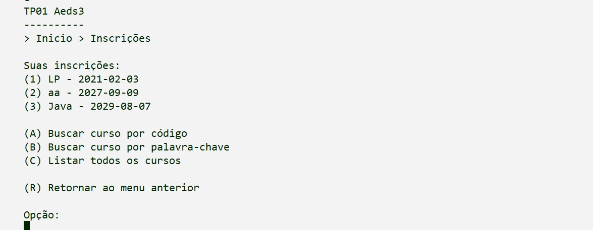
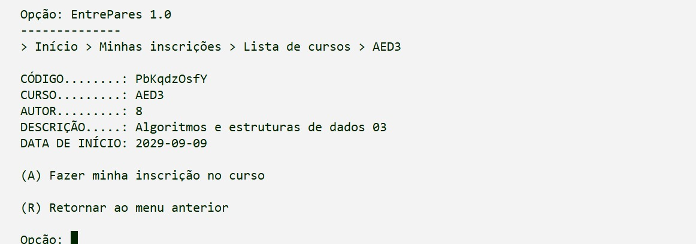
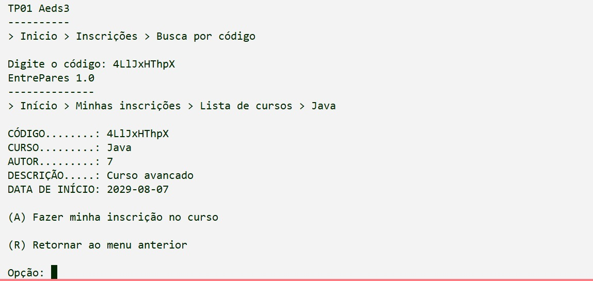

# TRABALHO PRÁTICO 02 - ALGORITMOS E ESTRUTURAS DE DADOS 3

**Pontifícia Universidade Católica**
**Ciência da Computação**

Video de demonstração do projeto:

**Autores:**
Ane M. Viana  
Camila C. Menezes  
Daniel G. Pereira  
Pedro Ítalo B. Cardoso  

---

Para rodar nosso projeto, utilize:  
 javac Principal.java menus\.java entidades\Usuario\.java entidades\Curso\.java entidades\CursoUsuario\.java

---

## Sumário

1. Descrição Completa
- Visão Geral
- Telas do Sistema (Prints)
- Classes Criadas
- Operações Implementadas
- Índices
2. Pergunta 01
3. Pergunta 02
4. Pergunta 03
5. Pergunta 04
6. Pergunta 05
7. Pergunta 06
8. Pergunta 07
9. Pergunta 08

---

## 1. Descrição Completa

### Visão Geral

O sistema desenvolvido consiste em uma aplicação de gerenciamento de cursos e inscrições, permitindo que usuários visualizem cursos, realizem inscrições e que os responsáveis pelos cursos gerenciem seus participantes.

Toda a persistência é feita em arquivos binários utilizando RandomAccessFile, com uso de índices (Árvore B+ e Hash Extensível) para garantir eficiência nas operações e evitar buscas sequenciais.

### Telas do Sistema (Prints)

### Menu Minhas Inscrições   
 

### Listagem paginada de cursos   
 

### Detalhes de um curso   
 

### Usuário inscrito no curso   
 

### Gerenciamento de inscritos    
  
 

### Busca por código NanoID   

### Classes Criadas

CursoUsuario:
- Representa a relação N:N entre cursos e usuários.
- Armazena:
- idCursoUsuario
- idCurso
- idUsuario
- dataInscricao
- cancelado

ArquivoCursoUsuario:
- Responsável pelo CRUD da entidade CursoUsuario.
- Implementa os índices utilizando Árvore B+ e Hash Extensível.

InscritoInfo:
- Utilizada para reunir informações do usuário e da inscrição em uma única estrutura.

### Operações Implementadas

CursoUsuario:
- Criar inscrição
- Ler inscrição
- Atualizar inscrição
- Cancelar/remover inscrição

### Índices

#### Árvore B+ 01 — idUsuario → idCursoUsuario

Implementada através do índice: private ArvoreBMais<ParIdId> idxUsuarioCurso;

Permite recuperar rapidamente todas as inscrições de um usuário sem percorrer o arquivo inteiro.

Método principal: readAllByIdUsuario(int idUsuarioBuscado)

#### Árvore B+ 02 — idCurso → idCursoUsuario
Implementada através do índice: private ArvoreBMais<ParIdId> idxCursoUsuario;
Permite recuperar rapidamente todos os usuários inscritos em um curso.

Método principal: readAllByIdCurso(int idCursoBuscado)

#### Hash Extensível — idCursoUsuario → endereço
Implementado através do índice: private HashExtensivel<ParIDEndereco> idxDireto;

Utilizado para localizar diretamente um registro no arquivo a partir do ID da inscrição.

Métodos que utilizam o índice:
- readById()
- delete()
- update()

---

## 2. Pergunta 01

**Há um CRUD da entidade de associação CursoUsuario (que estende a classe ArquivoIndexado, acrescentando Tabelas Hash Extensíveis e Árvores B+ como índices diretos e indiretos conforme necessidade) que funciona corretamente?**

Sim. Foi implementado um CRUD funcional para a entidade de associação CursoUsuario, responsável pelo relacionamento N:N entre usuários e cursos.

A implementação utiliza:

- Hash Extensível como índice direto;
- Árvores B+ como índices indiretos;
- RandomAccessFile para persistência dos registros.

Embora a implementação não utilize diretamente herança da classe ArquivoIndexado, ela segue a mesma arquitetura de persistência e indexação proposta no trabalho.

---

## 3. Pergunta 02

**A visão de inscrições está corretamente implementada e permite consultas aos cursos em que um usuário está inscrito?**

Sim. O sistema possui uma visão de inscrições que permite ao usuário consultar todos os cursos em que está inscrito.

Essa funcionalidade foi implementada utilizando a entidade de associação CursoUsuario e os índices com Árvores B+, evitando buscas sequenciais no arquivo principal.

A recuperação das inscrições do usuário é feita pelo método:

- readAllByIdUsuario(int idUsuarioBuscado)

Esse método utiliza a árvore B+:

- idUsuario → idCursoUsuario

permitindo localizar rapidamente todas as inscrições associadas a um usuário.

Além disso, o sistema permite:

- visualizar os dados completos do curso;
- cancelar inscrições;
- impedir inscrições duplicadas;
- validar cursos cancelados ou com inscrições encerradas.

---

## 4. Pergunta 03

**A visão de cursos funciona corretamente e permite a gestão dos usuários inscritos em um curso?**

Sim. A visão de cursos foi implementada corretamente e permite ao dono do curso gerenciar os usuários inscritos. O sistema possibilita:

- localizar cursos pelo código NanoID;
- visualizar os detalhes completos do curso;
- listar os usuários inscritos em um curso específico;
- consultar rapidamente as inscrições utilizando índices com Árvores B+;
- remover inscrições de usuários;
- validar estados do curso (aberto, encerrado, cancelado e concluído).

---

## 5. Pergunta 04

**Há uma visualização dos cursos de outras pessoas por meio de um código NanoID?**

Sim, o sistema possui visualização de cursos de outras pessoas por meio de um código NanoID.

Cada curso possui um código único armazenado no atributo codigo, permitindo que usuários encontrem cursos específicos sem precisar navegar pela listagem completa.

---

## 6. Pergunta 05

**A integridade do relacionamento entre cursos e usuários está mantida em todas as operações?**

Sim, a integridade do relacionamento entre cursos e usuários está mantida em todas as operações implementadas.

A entidade CursoUsuario representa a relação N:N entre usuários e cursos, garantindo que uma inscrição sempre associe corretamente um idUsuario a um idCurso.

---

## 7. Pergunta 06

**O trabalho compila corretamente?**

Sim. O projeto compila corretamente, sem apresentar erros de compilação. Todas as classes foram estruturadas de forma consistente, respeitando a organização proposta pela arquitetura MVC, e as dependências entre os componentes foram devidamente tratadas.

---

## 8. Pergunta 07

**O trabalho está completo e funcionando sem erros de execução?**

Sim. Durante os testes realizados pelo grupo, as funcionalidades implementadas funcionaram corretamente, incluindo o CRUD de inscrições, os índices com Árvores B+ e Hash Extensível, as consultas de cursos e o gerenciamento de inscritos.

Não foram encontrados erros de execução nos cenários testados.

---

## 9. Pergunta 08

**O trabalho é original e não a cópia de um trabalho de outro grupo?**

Sim. O trabalho foi desenvolvido de forma original pelo grupo, com base nos conceitos abordados em sala de aula. A implementação das funcionalidades, organização do código e decisões de projeto refletem o entendimento e aplicação prática dos conteúdos estudados, não sendo cópia de outros trabalhos.
